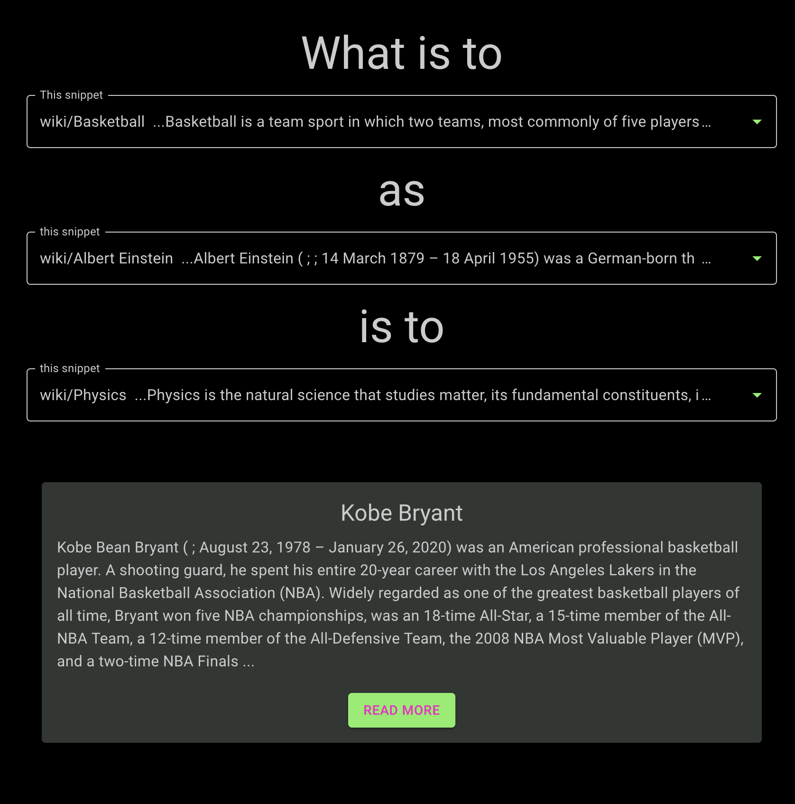

# Vector Analogies on Wikipedia
### Powered by [Modal](https://modal.com) & [Weaviate](https://weaviate.io)

## What is this for?

This is a sample project that shows how to combine the serverless infrastructure of [Modal](https://modal.com)
with the search capabilities of [Weaviate](https://weaviate.io)
for projects that combine data-intensive Python compute, like neural network inference,
with data-intensive storage, like storing all of Wikipedia.

It's intended as a jumping off point for your own code,
and it supports a [live demo application](https://vector-analogies-wikipedia.vercel.app/).

## What does it do?

The `frontend` of this project (written in React, hosted on [Vercel](https://vercel.com))
allows users to construct "vector analogies" of the form made famous by [Word2Vec](https://arxiv.org/abs/1301.3781).
For example, the approximate equation

```
Albert Einstein - Physics + Basketball ~= Kobe Bryant
```

expresses the analogy "Kobe Bryant is the Albert Einstein of basketball".
We can compute it by applying those operations to embedding vectors of each concept,
where `~=` is implemented using approximate nearest-neighbor search.

Here's that analogy computed and visualized in this app:



Where Word2Vec used word embeddings to express concepts, we use snippets of Wikipedia articles.
The dataset used was constructed from the March 2022 WikiMedia dump [by Hugging Face](https://huggingface.co/datasets/wikipedia).

Users can type into each search bar to find a snippet of interest, using Weaviate text search under the hood,
and once they've selected the three components of their analogy,
the frontend kicks off a vector search to complete it.

Both searches are coordinated by a `backend` Python service running on Modal.

Modal is also used to construct embeddings for snippets and then insert them into Weaviate.
You can read more about the embedding process [here](https://modal.com/blog/embedding-wikipedia).
We also wrote up the concerns and considerations for integrating Modal with Weaviate [here](https://modal.com/blog/wikipedia-weaviate).

## How is it set up?

### Set up a Python environment
1. Set up a Python environment and `pip install modal==0.62.140`.

### Deploy a serverless Weaviate client with Modal
1. Add `WCS_URL=https://gzimzbmdr6ycxyja715rsa.c0.us-west4.gcp.weaviate.cloud` and `WCS_RO_KEY=tUeQG12AkFLBY9SYOWVh2y00hZ25yu8va0UP` key to a [`modal.Secret`](https://modal.com/docs/guide/secrets) called `wiki-weaviate`.
1. Run `modal deploy backend.database` to create a database client on Modal.
This client is _serverless_, meaning it is free when not in use and scales automatically with load.

### Optional: Embed Wikipedia yourself
1. Set up a Weaviate database, e.g. via [Weaviate Cloud Services](https://weaviate.io/developers/weaviate/installation/weaviate-cloud-services).
1. Add your `WCS_URL`, `WCS_ADMIN_KEY`, and `WCS_RO_KEY` key to a [`modal.Secret`](https://modal.com/docs/guide/secrets) called `wiki-weaviate`.
1. To embed the dataset and send the results to Weaviate, run `modal run backend.ingest`. This can take several hours. Use the `--down-scale` option to reduce the fraction of the data you ingest. 10% is enough to get fair results, and 1% will do in a pinch.

### Run the React frontend
1. Run `npm install` in the `frontend` directory.
1. Change the value of `VITE_MODAL_WORKSPACE` in `frontend/.env` to the name of your Modal workspace (by default, your GitHub username).
1. Run a hot-reloading local version of the frontend with `npm run dev`, so you can play around with it.

### Deploy the React frontend
1. Host the frontend somewhere, e.g. [Vercel](https://vercel.com/guides/deploying-react-with-vercel).
